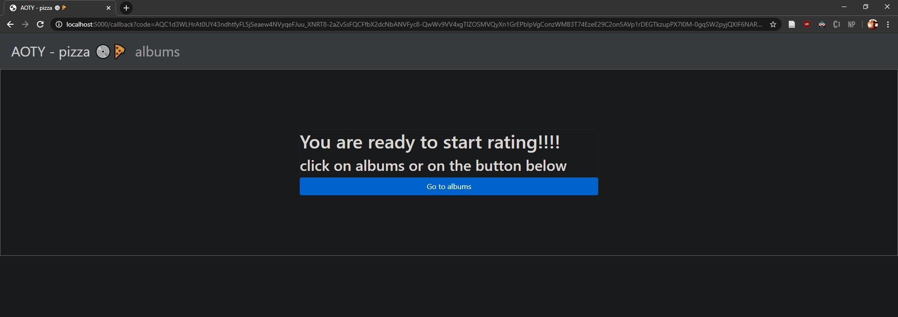
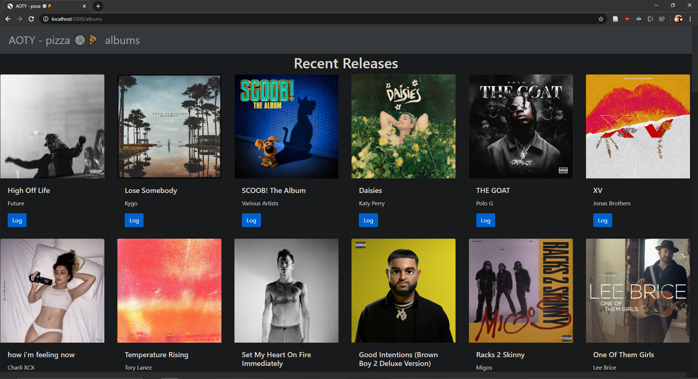
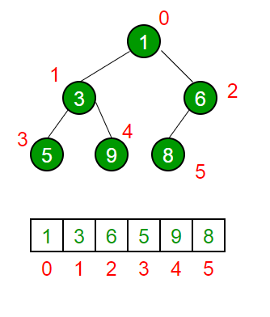

# Aoty pizza 💿🍕
Aoty pizza has been updated!!!!!!!!! Some of the changes added to aoty-pizza are: log in with spotify, changed the way albums are stored in memory, persistence of logged albums, and sorting works differently now. 

### Log in with spotify:
Now you can log in with spotify and rate the albums you have listened to recently and the new releases on the platform.

### New data structure for albums in memory:
Before albums were stored in memory as an array of dictionaries, this made it so that when you pressed the log button on any album on /albums the program would have to iterate through all of the albums untill it reached the correct one to continue the process. Now albums are stored as a dictionary of dictionaries with the id of the album as the main key. This means that when you press to log an album the program doesn't have to iterate through all of them, it can get to the right one directly throug its unique id!

### Data Persistence:
For every user that uses the app, a .txt file will be created containing a json with all of the albums they have rated. This file is re-written whenever a new album is logged and before displaying the logged albums in /dashboard it is read so that previously logged albums will be visible.

### New sorting:
1. Quicksort has been deprecated since we proved it was slower and consumed a lot more memory than heapsort. All of the sorting is now done with Heapsort.
2. Now the sorting methods have the "key" parameter which lets you sort through any of the numeric fields an album contains. This makes it so that we can sort by date in both descending and ascending order.


## Usage
First clone the repo.
Then get docker ready!!! To use aoty-pizza you need to build and run a docker container using the DOCKERFILE provided.
The commands you need to run are:

```console
your@console: path/to/aoty-pizza$ docker build --tag whichever-tag-you-want .
```
This command will build and tag an image from the DOCKERFILE contained in this repository. After this run the following:
```console
your@console: path/to/aoty-pizza$ docker run --publish 5000:5000 --detach --name aoty-pizza whichever-tag-you-want
```
This command should start running a container based on the image you just created!!!

Now we are almost ready to start rating.
If you aren't on docker toolbox, you can head over to http://localhost:5000 the aoty-pizza should be up and running.
If you are running docker toolbox, then you need to find out the ip that your computer has assigned to the docker machine.
To do this you just need to execute the following command.

```console
your@console: path/to/aoty-pizza$ docker-machine ip default
```
After executing this command the ip should be printed out on your console. To access aoty-pizza now you just need to type http://whatever-ip-you-got:5000

## Walkthrough 

When you first enter aoty-pizza you will be prompted to log in with spotify.


After clicking the log in with spotify button you will be redirected to a screen where, if you are not logged in to spotify, you will be prompted to log in:


after this, or if you were already logged in, you will see this:


Here you are prompted to give the relevant permissions to aoty pizza so we can see information like what you have been listening to recently.
Then you'll see this:



Now you can either press the button on the prompt or on the nav bar.
After you do either, you willl be redirected to a page that will look like this:




Here you can see spotify latest releases and your most recently played albums!!!!!


Now you just have to select an album and click on the log button. That will lead you to a screen like this one.


Now just rate it, love it, and/or review it.
After clicking on the log button you will be redirected to the dashboart page, which has your logged albums. (If you are redirected there, but do not see the album you just logged, just reload the page, sometimes the album doesn't get logged instantly)


In this page you'll see every log you make, alongside 4 buttons, if none of those buttons are clicked this page will show you the logs from earliest to latest. If you click one of those the albums will get sorted however the button describes (How I did that is the interesting part). 

## Data Structures

1. Arrays of Dictionaries: Since I have yet to implement a database, everything is currently running on the python runtime. To store the albums, I used arrays of dictionaries. Every album is a dictionary, a series of albums is an array of dictionaries. This is because it is easy to transform jsons into dictionaries and vice versa. This is usefull because most API calls are made with jsons, so it saves me time and memory to just use the json.loads() function from the python standard library rather than creating custom objects to store the albums. However this might change once a database is implemented. As it is, ./app/albums.py contains the class that is used to store and update the albums. This class acts as our pretend database for now. 

2. Dictionaries of Dictionaries: Before all albums in memory were handled by using arrays of dictionaries. This isn't as efficient because whenever you want to log something you have to iterate trough the array untill you find the album you are looking for. Whith the dictionarie of dictionaries, using the unique id of every album as the key for the main dictionary, you can save yourself having to iterate through arrays and access the album you want immediately. 

3. Heapsort vs. Quicksort: 
In an app like this, specially when it is extended and the social features implemented, sorting this kind of logs will be a recurring task. On the finished app you will have the ability to follow people and see in a dashboard similar to the one you can see right now all of your friends logs. All of this means that on the finished app, sorting albums will be a recurring task, and the amount of albums to be sorted could potentially grow to be around the thousands of albums. Therefore shoosing a good sorting algorithm is vital. 

As you might have notice, aoty-pizza has the option to sort the albums you have logged in two ways. The ascending and descending sorts are implemented using different sorting algorithms, Heapsort and Quicksort respectively. These are commonly known as the best sorting algorithns, however they are very different. I wasn't sure which to use so i implemented both and compared them. Profiling for my heapsort and quicksort implementations can be found on ./app/logs and will be discussed briefly over the next section.

Quicksort remains in the code of the app but is no longer used as there is no sensible reason to do so (As you will see if you read the discussion). Heapsort is just better in every scenario. Also The heapsort method has been slightly modified so you can sort by any numeric key you want. 


## Profiling Heapsort vs. Quicksort


Like Merge Sort, QuickSort is a Divide and Conquer algorithm. It picks an element as pivot and partitions the given array around the picked pivot Heap sort is a comparison based sorting technique based on Binary Heap data structure. These sorting algorithms are among the most used because they can easilly be implemented with arrays which is the most common data structure in web development and they are very reliable in terms of time complexity.


However, implementing the Heapsort poses a greater conceptual challenge as you need to stop thinking of your array as an array and start thinking of it as a heap. 



This problem shows why data structures are worth it. As you might have noticed on the table, time complexities are the same for both algorithms for their best and avarage cases. However their worst cases greatly differ as well as their memory efficiency. It might not look significant given nowedays we have very powerfull computers but as the profiling of my implementations shows, it is extremely significant.


As you can see heapsort manages to sort 10,000 elements in only 0.065 and without using any extra space whereas quicksort couldn't even sort 1,000  elements without the compiler shutting of the recursion because it was approaching a stack overflow.

These profiling logs are stored in ./app/logs , the files ./app/profiler_quicksort.py and ./app/profiler_heapsort.py have the code for profiling the implementations, you can play around with the amount of random ratings to give them to see how they would perform. The random function can also be changed to represent different distributions of data to see how the algorithms would behave under different circumstances. But as far as the specific use case, heap sort wins by a long shot. Hurrah for heaps!!!!
